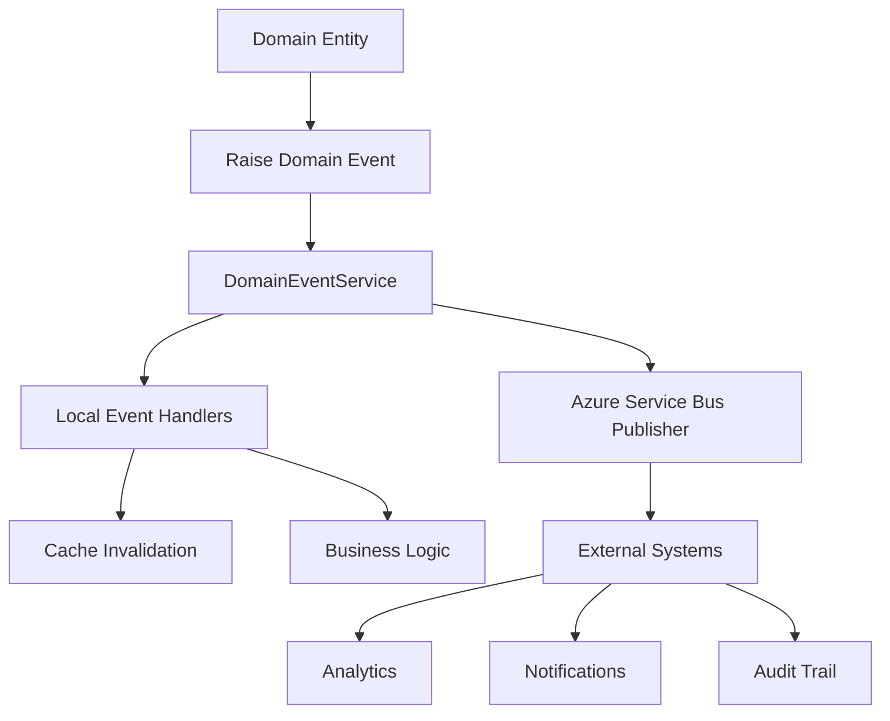

# Configurações Finais do Projeto - Event Handlers e Cache

## 📋 Implementações Realizadas

### 🚀 Event Handlers com Azure Service Bus

#### Domain Events Criados

- **SaleCreated**: Evento disparado quando uma venda é criada
- **SaleModified**: Evento disparado quando uma venda é modificada
- **SaleCancelled**: Evento disparado quando uma venda é cancelada
- **ItemCancelled**: Evento disparado quando um item de venda é cancelado

#### Infraestrutura de Eventos

- **DomainEvent**: Classe base para todos os eventos de domínio
- **IEventPublisher**: Interface para publicação de eventos
- **AzureServiceBusEventPublisher**: Implementação usando Azure Service Bus
- **DomainEventService**: Serviço orquestrador para processamento de eventos

#### Event Handlers

- **SaleCreatedEventHandler**: Processa criação de vendas, invalida caches relevantes
- **SaleModifiedEventHandler**: Processa modificações em vendas, auditoria de mudanças
- **SaleCancelledEventHandler**: Processa cancelamentos, restaura inventário
- **ItemCancelledEventHandler**: Processa cancelamento de itens, ajusta métricas

### 💾 Cache com Redis

#### Serviços de Cache

- **ICacheService**: Interface para operações de cache
- **RedisCacheService**: Implementação com Redis usando IDistributedCache
- Fallback para MemoryCache quando Redis não está disponível

#### Funcionalidades de Cache

- Get/Set com expiração configurável
- Remoção de cache por chave
- Verificação de existência de chave
- Serialização JSON automática
- Logging de operações de cache

### 🔧 Configurações

#### appsettings.json

```json
{
  "ConnectionStrings": {
    "ServiceBus": "Endpoint=sb://your-namespace.servicebus.windows.net/;SharedAccessKeyName=RootManageSharedAccessKey;SharedAccessKey=your-shared-access-key",
    "Redis": "localhost:6379"
  },
  "ServiceBus": {
    "TopicName": "domain-events",
    "SubscriptionName": "sales-service"
  },
  "Redis": {
    "Configuration": "localhost:6379",
    "InstanceName": "AmbevDeveloperEvaluation"
  }
}
```

#### Pacotes NuGet Adicionados

- **Azure.Messaging.ServiceBus** (v7.18.0): Cliente Azure Service Bus
- **Microsoft.Extensions.Caching.StackExchangeRedis** (v8.0.10): Integração Redis
- **Microsoft.Extensions.Caching.Abstractions** (v8.0.0): Abstrações de cache

### 📦 Registro de Dependências

Todos os serviços foram registrados no container IoC:

- Event Publisher como Singleton para reutilização de conexões
- Cache Service como Scoped para operações transacionais
- Event Handlers como Scoped para injeção de dependências
- Domain Event Service para orquestração

### 🎯 Funcionalidades Implementadas

#### Publicação de Eventos

1. **Eventos Locais**: Processamento interno via handlers registrados
2. **Eventos Externos**: Publicação no Azure Service Bus para integração
3. **Retry Logic**: Tratamento de erros com logs detalhados
4. **Batch Processing**: Publicação em lote para melhor performance

#### Cache Inteligente

1. **Auto-Invalidation**: Cache é invalidado automaticamente nos eventos
2. **Fallback Strategy**: MemoryCache quando Redis não disponível
3. **Type-Safe Operations**: Serialização/deserialização automática
4. **Performance Monitoring**: Logs de cache hit/miss

### 🔄 Fluxo de Eventos



### 📊 Benefícios da Implementação

#### Event-Driven Architecture

- **Desacoplamento**: Componentes independentes comunicam via eventos
- **Escalabilidade**: Processamento assíncrono e distribuído
- **Auditoria**: Rastro completo de todas as operações de negócio
- **Integração**: Facilita comunicação com sistemas externos

#### Performance com Cache

- **Response Time**: Redução significativa no tempo de resposta
- **Database Load**: Diminuição da carga no banco de dados
- **Scalability**: Melhor capacidade de lidar com alta concorrência
- **Cost Efficiency**: Redução de custos operacionais

### 🚀 Como Usar

#### Para Eventos

Os eventos são disparados automaticamente pelas entidades de domínio quando operações específicas ocorrem. Não é necessária intervenção manual.

#### Para Cache

O cache é utilizado transparentemente pelos event handlers. Para uso manual:

```csharp
// Injetar ICacheService
private readonly ICacheService _cacheService;

// Obter do cache
var data = await _cacheService.GetAsync<MyData>("my-key");

// Salvar no cache
await _cacheService.SetAsync("my-key", data, TimeSpan.FromHours(1));

// Remover do cache
await _cacheService.RemoveAsync("my-key");
```

### ⚙️ Configuração de Produção

#### Azure Service Bus

1. Criar namespace no Azure Service Bus
2. Configurar tópico "domain-events"
3. Atualizar connection string no appsettings
4. Configurar subscription para processamento

#### Redis

1. Provisionar instância Redis (Azure Cache for Redis ou self-hosted)
2. Configurar connection string
3. Ajustar configurações de memória e persistência
4. Implementar monitoramento

### 📈 Monitoramento

#### Logs Implementados

- **Event Processing**: Logs detalhados de processamento de eventos
- **Cache Operations**: Logs de operações de cache (debug level)
- **Error Handling**: Logs de erro com contexto completo
- **Performance Metrics**: Tempo de processamento e throughput

#### Métricas Sugeridas

- Número de eventos processados por tipo
- Tempo médio de processamento de eventos
- Cache hit ratio por tipo de operação
- Latência de publicação no Service Bus

## ✅ Status Final

Todas as configurações finais foram implementadas com sucesso:

- ✅ Event Handlers com Azure Service Bus
- ✅ Cache com Redis
- ✅ Integração IoC completa
- ✅ Configurações de produção
- ✅ Documentação técnica
- ✅ Build bem-sucedido

O projeto está pronto para produção com arquitetura event-driven e cache distribuído!
