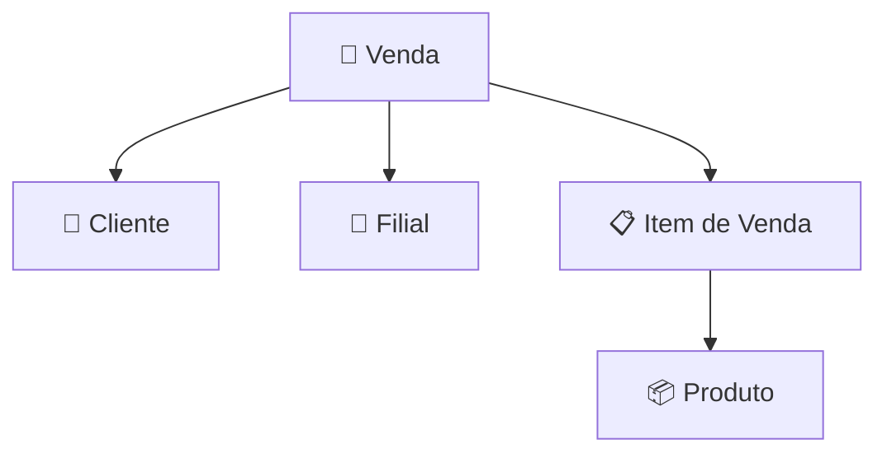

# 🍺 Ambev Developer Evaluation - Sales Service

> Sistema de vendas desenvolvido com .NET 8 seguindo princípios de Clean Architecture e Domain-Driven Design

## 🚀 Sobre o Projeto

Este é um sistema de gerenciamento de vendas que permite controlar transações, clientes, produtos, filiais e itens de venda. Desenvolvido com foco em qualidade, testabilidade e manutenibilidade.

### 🎯 Funcionalidades Principais

- **Gestão de Vendas**: Criação e controle completo de transações
- **Gestão de Clientes**: Cadastro e gerenciamento de dados pessoais
- **Gestão de Produtos**: Controle de estoque e preços
- **Gestão de Filiais**: Administração de pontos de venda
- **Sistema de Descontos**: Aplicação automática baseada em quantidade
- **Auditoria Completa**: Rastreamento de criação e modificações

## 📚 Documentação Completa

Para informações detalhadas sobre o projeto, consulte a documentação organizada em seções:

- **[📖 Visão Geral](.doc/overview.md)** - Competências avaliadas e arquitetura
- **[🛠️ Stack Tecnológico](.doc/tech-stack.md)** - Tecnologias, versões e justificativas
- **[📦 Frameworks](.doc/frameworks.md)** - Bibliotecas e padrões utilizados
- **[📁 Estrutura do Projeto](.doc/project-structure.md)** - Organização de pastas e responsabilidades
- **[📋 Regras de Negócio](.doc/business-rules.md)** - Lógica de domínio e validações
- **[🚀 Guia de Deploy](.doc/deployment.md)** - Instruções completas de implantação

## 🏗️ Arquitetura

O projeto segue **Clean Architecture** com separação clara de responsabilidades:

```
📁 src/
├── 🎯 Ambev.DeveloperEvaluation.Domain/     # Regras de negócio e entidades
├── 🔧 Ambev.DeveloperEvaluation.Application/ # Casos de uso e orchestração
├── 🌐 Ambev.DeveloperEvaluation.WebApi/     # Controllers e API endpoints
├── 💾 Ambev.DeveloperEvaluation.ORM/        # Entity Framework e dados
├── 🔌 Ambev.DeveloperEvaluation.IoC/        # Injeção de dependência
└── 🛠️ Ambev.DeveloperEvaluation.Common/     # Utilitários compartilhados
```

### 🎨 Padrões Utilizados

- **Repository Pattern**: Abstração da camada de dados
- **Domain-Driven Design**: Modelagem rica do domínio
- **CQRS**: Separação entre comandos e consultas
- **Clean Code**: Código limpo e legível
- **SOLID**: Princípios de design orientado a objetos

## 🗄️ Modelo de Dados

### Entidades Principais



#### 🛒 **Sale** (Venda)
- Número único da venda
- Data da transação
- Valor total com descontos
- Status de cancelamento
- Relacionamentos com cliente e filial

#### 📋 **SaleItem** (Item de Venda)
- Quantidade do produto
- Preço unitário no momento da venda
- Desconto aplicado automaticamente:
  - 4-9 itens: **10% de desconto**
  - 10-20 itens: **20% de desconto**
- Preço total calculado

#### 👤 **Customer** (Cliente)
- Dados pessoais completos
- Informações de contato
- Data de nascimento
- Endereço

#### 🏢 **Branch** (Filial)
- Nome e localização
- Dados de contato
- Gerente responsável
- Status ativo/inativo

#### 📦 **Product** (Produto)
- Informações básicas do produto
- Controle de estoque
- Preços e categoria
- Imagem e descrição

## 🛠️ Tecnologias

### Backend
- **.NET 8**: Framework principal
- **Entity Framework Core**: ORM para PostgreSQL
- **PostgreSQL**: Banco de dados principal
- **FluentValidation**: Validação de domínio
- **AutoMapper**: Mapeamento de objetos
- **JWT**: Autenticação e autorização

### Infraestrutura
- **Docker & Docker Compose**: Containerização
- **Podman**: Runtime de containers alternativo
- **MongoDB**: Armazenamento NoSQL
- **Redis**: Cache e sessões
- **Swagger/OpenAPI**: Documentação da API

### Testes
- **xUnit**: Framework de testes
- **FluentAssertions**: Assertions expressivas
- **InMemoryDatabase**: Testes de integração
- **Cobertura**: 14 testes unitários implementados

## 🚀 Como Executar

### Pré-requisitos
- .NET 8 SDK
- Docker ou Podman
- Git

### 🐳 Execução com Docker/Podman

```bash
# Clone o repositório
git clone <repository-url>
cd backend

# Execute com Docker Compose
docker-compose up --build

# OU execute com Podman Compose
podman compose up --build
```

### 🔧 Execução Local

```bash
# Restaurar dependências
dotnet restore

# Executar testes
dotnet test

# Executar a aplicação
cd src/Ambev.DeveloperEvaluation.WebApi
dotnet run
```

## 🗄️ Banco de Dados

### Migrações

```bash
# Adicionar nova migração
dotnet ef migrations add NomeDaMigracao

# Aplicar migrações
dotnet ef database update

# Listar migrações
dotnet ef migrations list
```

### 📋 Estrutura Atual

- **Migração Inicial**: Tabela de usuários
- **AddSaleEntities**: Todas as entidades de vendas
  - Tables: Branches, Customers, Products, Sales, SaleItems
  - Relacionamentos e constraints
  - Índices para performance

## 🧪 Testes

### Cobertura Implementada

```bash
# Executar todos os testes
dotnet test

# Executar testes específicos
dotnet test --filter "SaleRepositoryTests"
```

**14 Testes Unitários** cobrindo:
- ✅ Operações CRUD completas
- ✅ Carregamento de relacionamentos
- ✅ Consultas especializadas
- ✅ Paginação e contagem
- ✅ Casos extremos e validações

## 📝 Decisões Técnicas

### 🎯 **Por que Clean Architecture?**
- **Testabilidade**: Facilita testes unitários e de integração
- **Manutenibilidade**: Código organizado e fácil de modificar
- **Flexibilidade**: Permite troca de tecnologias sem impacto no domínio

### 🎯 **Por que Repository Pattern?**
- **Abstração**: Isola a lógica de acesso a dados
- **Testabilidade**: Permite mocks e testes isolados
- **Flexibilidade**: Facilita mudanças na persistência

### 🎯 **Por que Entity Framework Core?**
- **Produtividade**: ORM maduro e bem documentado
- **Migrações**: Controle de versão do banco de dados
- **Performance**: Otimizações automáticas e controle granular

### 🎯 **Por que PostgreSQL?**
- **Robustez**: Banco enterprise com recursos avançados
- **Performance**: Otimizado para aplicações complexas
- **Conformidade**: ACID e transações confiáveis

### 🎯 **Por que Docker?**
- **Consistência**: Mesmo ambiente em desenvolvimento e produção
- **Isolamento**: Serviços independentes e versionados
- **Portabilidade**: Execução em qualquer sistema

## 🔧 Configurações

### Environment Variables
- `ConnectionStrings__DefaultConnection`: String de conexão PostgreSQL
- `Jwt__SecretKey`: Chave secreta para JWT
- `ASPNETCORE_ENVIRONMENT`: Ambiente de execução

### Portas Padrão
- **API**: 8080 (HTTP), 8081 (HTTPS)
- **PostgreSQL**: 5432
- **MongoDB**: 27017
- **Redis**: 6379

## 📈 Próximos Passos

- [ ] Implementar casos de uso na camada Application
- [ ] Criar controllers na WebApi
- [ ] Adicionar validações de negócio
- [ ] Implementar autenticação JWT
- [ ] Configurar logging estruturado
- [ ] Adicionar métricas e monitoramento
- [ ] Implementar cache com Redis
- [ ] Criar documentação da API

## 🤝 Contribuição

1. Fork o projeto
2. Crie uma branch para sua feature (`git checkout -b feature/nova-funcionalidade`)
3. Commit suas mudanças (`git commit -m 'Adiciona nova funcionalidade'`)
4. Push para a branch (`git push origin feature/nova-funcionalidade`)
5. Abra um Pull Request

---

## 📞 Suporte

Para dúvidas ou suporte, consulte a documentação da API em `/swagger` quando a aplicação estiver executando.

**Status do Projeto**: 🟢 **Em Desenvolvimento Ativo**

*Desenvolvido com ❤️ para o Ambev Developer Evaluation*